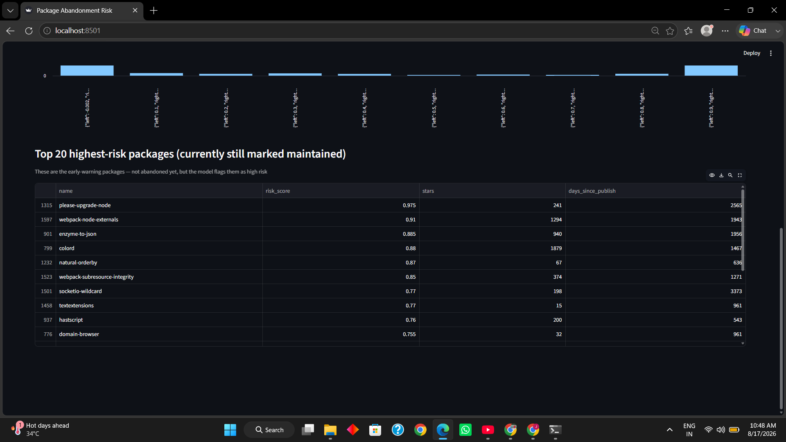
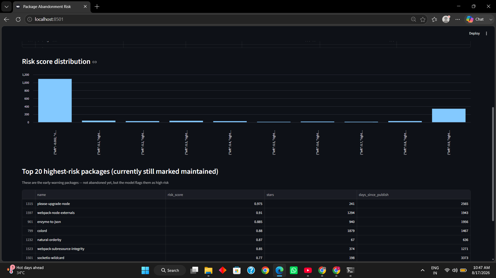
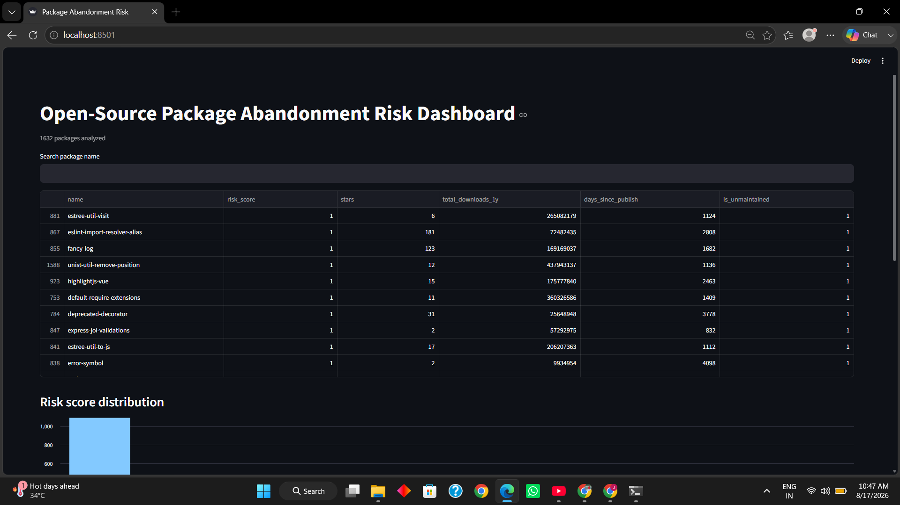

# Open-Source Package Abandonment Predictor

A big data analytics project that predicts which widely-used npm packages are at risk of becoming unmaintained — before they actually go dark.

## Why this matters

Modern software depends on a deep tree of open-source packages, and most teams have no idea which of their dependencies are quietly heading toward abandonment. A package with thousands of weekly downloads can still stop receiving security patches the moment its one maintainer walks away. This project builds an early-warning system for that risk, using real registry and GitHub activity data instead of guesswork.

## How it works

```
npm registry API  ─┐
                    ├─▶ raw JSON (per package) ─▶ PySpark feature engineering ─▶ labeled dataset ─▶ Random Forest model ─▶ Streamlit dashboard
GitHub API        ─┘
```

1. **Data collection** — pulls metadata, download trends, and GitHub repo activity (stars, commits, contributors, issues) for ~1,750 popular npm packages, sourced dynamically from npm's own search API across categories like React, testing, CSS, build tools, and CLI utilities.
2. **Feature engineering** — PySpark aggregates a year of daily download data, joins npm and GitHub signals, and computes activity-recency features.
3. **Labeling** — a package is labeled `unmaintained` if its GitHub repo has had no push activity in 12+ months.
4. **Modeling** — a Random Forest classifier trained on the labeled data.
5. **Dashboard** — a searchable Streamlit app showing every package's predicted risk score, including an early-warning list of currently-maintained packages the model flags as high-risk.

## Results

- **1,632** packages with complete npm + GitHub data
- Class balance: 388 unmaintained / 1,244 maintained (~24% positive class)
- **91% accuracy**, **91% recall** on the unmaintained class (the model catches the packages that matter)

| metric | maintained | unmaintained |
|---|---|---|
| precision | 0.97 | 0.76 |
| recall | 0.91 | 0.91 |
| f1-score | 0.94 | 0.83 |

**Top predictive features:** days since last npm publish (~51%), total commit count, version count, forks, stars.

`days_since_publish` dominating the model is worth calling out honestly: it's a genuinely strong signal (npm release cadence tracks maintenance closely), but it also means the model currently leans less on community-health signals like stars, forks, and contributor activity.

### Ablation: does the model still work without `days_since_publish`?

To check how much of the model's performance comes from that one dominant feature, a second Random Forest was trained on the same data with `days_since_publish` removed:

| metric | With the feature | Without it |
|---|---|---|
| Accuracy | 91% | 86% |
| Unmaintained recall | 91% | 64% |
| Unmaintained precision | 76% | 74% |

Dropping the feature costs the model most of its recall on the class that actually matters — it misses four times as many truly-abandoned packages (28 vs 7 in the test set). That confirms npm publish recency is doing real, non-redundant work, not just standing in for something else. On the upside, without it feature importance spreads out much more evenly across total commit count, version count, forks, and stars (each contributing 6–24%) instead of one feature dominating — meaning GitHub-side activity alone still carries meaningful, if weaker, signal on its own.

## Project structure

```
├── package_list.txt          # scaled list of ~1,750 npm packages
├── npm_ingest.py              # pulls npm registry metadata + download history
├── github_ingest.py           # pulls GitHub repo activity for each package
├── scale_package_list.py      # builds the package list from npm's search API
├── build_features.py          # PySpark feature engineering + labeling
├── model_train.py             # trains and evaluates the Random Forest model
├── dashboard.py                # Streamlit risk-score dashboard
├── labeled_dataset.csv         # output of build_features.py
└── abandonment_model.pkl       # trained model
```

## Running it yourself

```bash
python -m venv venv
venv\Scripts\activate            # Windows
pip install requests python-dotenv pyspark scikit-learn joblib streamlit

# 1. Data collection
python scale_package_list.py
python npm_ingest.py
python github_ingest.py          # needs a GITHUB_TOKEN in a .env file

# 2. Feature engineering + labeling
python build_features.py

# 3. Model training
python model_train.py

# 4. Dashboard
streamlit run dashboard.py
```

## Data sources

- [npm Registry API](https://registry.npmjs.org/) — package metadata and download stats
- [GitHub API](https://docs.github.com/en/rest) — repository activity, commits, contributors

## Future work

- Extend data collection to PyPI and crates.io for a cross-ecosystem view
- Move the risk-scoring pipeline to a scheduled batch job so scores stay current




